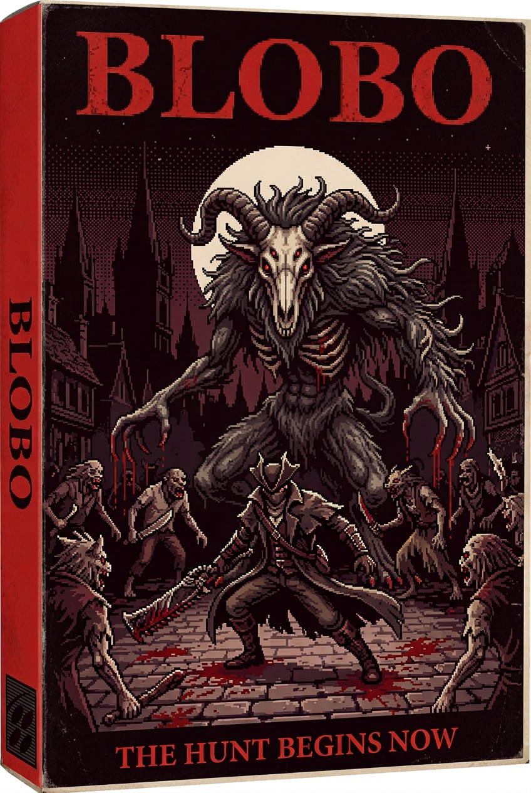
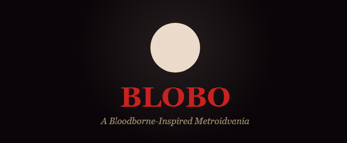
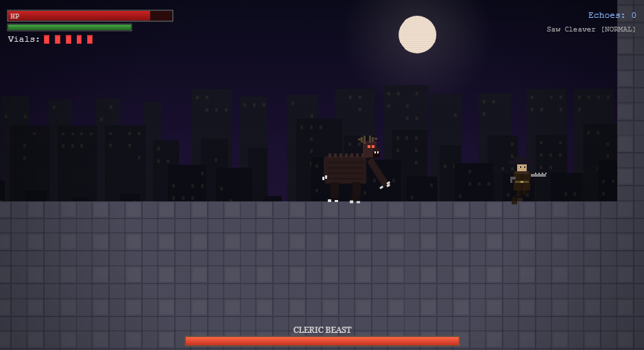

# Bloodborne 2D Metroidvania Demo — "BLOBO"
A sidescrolling Metroidvania demo inspired by Bloodborne's story, themes, and mechanics. One interconnected level culminating in a boss fight. All core Bloodborne combat systems translated to 2D.



## Screenshots



## Demo on YouTube
[](https://youtu.be/ovsavIS-pDU)

## Proposed Architecture

### File Structure
```
blobo/
├── index.html          — Entry point, canvas setup, HUD overlay
├── css/
│   └── style.css       — HUD styling, menus, UI overlays
├── js/
│   ├── main.js         — Game loop, state machine, initialization
│   ├── input.js        — Keyboard/gamepad input handling
│   ├── player.js       — Hunter: movement, combat, trick weapon, rally, parry
│   ├── enemies.js      — Enemy types: Beast, Huntsman, Snatcher
│   ├── boss.js         — Father Gascoigne-inspired boss (2 phases)
│   ├── level.js        — Tile map, collision, camera, room transitions
│   ├── particles.js    — Blood splatter, dodge trails, visceral FX
│   ├── hud.js          — HP bar, stamina, blood vials, blood echoes, rally meter
│   ├── audio.js        — SFX manager (procedural/Web Audio API)
│   └── renderer.js     — Canvas 2D rendering, sprite animation, parallax BG
└── assets/             — (No external assets — all sprites drawn via canvas)
```

---

## Core Bloodborne Mechanics (2D Translations)

### 1. Trick Weapon System
- **Saw Cleaver** — the demo weapon
  - **Normal Form**: Fast, short-range slashes (3-hit combo)
  - **Trick Form (Extended)**: Slower, longer-range sweeps (2-hit combo, more damage)
  - **Transform Attack**: Press transform mid-combo for a powerful transition strike
- Triggered by a dedicated key (`T` or `F`)

### 2. Rally System
- After taking damage, a portion of lost HP is shown as a **orange "rally" segment** on the HP bar
- Hitting enemies within a ~3 second window recovers that HP
- Rally window decays over time; the recoverable amount shrinks
- Encourages aggressive play — the core Bloodborne philosophy

### 3. Parry → Visceral Attack
- **Gun Parry**: Press the gun button (`K` or `Shift`) to fire the Hunter Pistol
  - If it hits an enemy during their **attack wind-up frames**, the enemy staggers
  - A brief window appears to press attack for a **Visceral Attack** (massive damage + HP recovery + invincibility frames)
- Mistiming the parry leaves the player vulnerable (recovery animation)

### 4. Quickstep Dodge
- Press dodge (`Space`) + direction for a fast dash with **i-frames** (invincibility frames)
- Costs stamina; no i-frames if stamina is depleted
- 4-directional in 2D: left, right, back-dodge (short hop backward)

### 5. Stamina System
- Attacking, dodging, and sprinting consume stamina
- Stamina regenerates when not performing actions (briefly paused after an action)
- Running out of stamina leaves the player briefly exhausted (slower regen)

### 6. Blood Vials
- Start with **5 Blood Vials** (mapped to `Q` or `E`)
- Each heals ~40% HP with a brief animation
- No refill until death/lamp reset

### 7. Blood Echoes & Death
- Enemies drop Blood Echoes (XP/currency — shown on HUD)
- On death, echoes are dropped at death location
- Respawn at the last **Lamp** (checkpoint); retrieve echoes or lose them on second death

---

## Level Design — "Central Yharnam" (Demo)

A single interconnected level inspired by Central Yharnam:

```
[Lamp/Start] → [City Streets] → [Bridge w/ Huntsmen] 
                     ↓
              [Sewer Shortcut]  ←  (Locked gate, opens from other side)
                     ↓
         [Cathedral Approach] → [Boss Arena: Father Gascoigne]
```

### Areas
| Area | Enemies | Features |
|------|---------|----------|
| **Lamp / Hunter's Dream** | None | Checkpoint, tutorial messages |
| **City Streets** | Huntsmen (patrol), Crazed Townsfolk | Breakable crates, items |
| **Bridge** | Huntsmen group, Beast on chain | First challenge encounter |
| **Sewer Shortcut** | Sewer Rats, Slime | Opens shortcut gate back to start |
| **Cathedral Approach** | Church Servants | Pre-boss area, blood vial drops |
| **Boss Arena** | **Cleric Beast** (boss) | 2-phase fight, fog gate |

### Tile System
- **16×16 pixel tiles** scaled 3x (48px rendered)
- All tiles drawn procedurally (stone, brick, sewer, cathedral)
- Parallax backgrounds: moonlit sky, Yharnam rooftops, cathedral silhouettes

---

## Boss: Cleric Beast (Inspired)

### Phase 1 (100%–50% HP)
- **Claw Swipe**: Medium range, telegraphed
- **Leap Attack**: Jumps to player position, AoE landing
- **3-Hit Combo**: Left-right-overhead, dodgeable
- Parryable on specific attacks (claw swipe wind-up)

### Phase 2 (50%–0% HP)
- Becomes faster, gains new moves
- **Frenzy Howl**: Brief AoE stagger if too close
- **Charge Attack**: Rushes across arena
- Attack windows get shorter; rally becomes critical for survival
- Visual change: more blood particles, eyes glow red

---

## Controls

| Action | Key | Alt Key |
|--------|-----|---------|
| Move Left/Right | `A` / `D` | `←` / `→` |
| Jump | `W` | `↑` |
| Dodge/Quickstep | `Space` | — |
| Light Attack | `J` | `Z` |
| Gun Parry | `K` | `X` |
| Trick Weapon Transform | `L` | `C` |
| Use Blood Vial | `Q` | `V` |
| Interact / Open | `E` | — |

---

## Visual Style

- **Pixel art aesthetic** — all sprites rendered procedurally on canvas (no external image files)
- **Dark, gothic color palette**: deep purples, blood reds, sickly greens, moonlit blues
- **Particle effects**: Blood splatters on hit, dodge dust trails, visceral attack blood burst
- **Lighting**: Simulated with radial gradients around lanterns and the moon
- **Screen shake** on heavy hits and visceral attacks
- **Parallax scrolling** backgrounds (3 layers: sky, buildings, foreground details)

---

## Audio (Procedural via Web Audio API)

All sound effects generated procedurally — no external audio files:
- Weapon slash (noise burst + filter sweep)
- Gun shot (short noise pop)
- Parry stagger (metallic ring)
- Visceral attack (wet crunch)
- Dodge swoosh
- Enemy growls (filtered noise)
- Boss music: Simple ominous drone with rhythmic percussion

---

## UI / HUD Design

```
┌─────────────────────────────────────────┐
│ [HP BAR ████████░░░ ]  [STAM ██████░ ]  │
│ [Rally ░░██░░░░░░░ ]   Vials: ⚗⚗⚗⚗⚗   │
│                          Echoes: 1250   │
│                                         │
│              GAME AREA                  │
│                                         │
│                                         │
│                                         │
│                                         │
│  [BOSS HP BAR ████████████████░░░░░░ ]  │
└─────────────────────────────────────────┘
```

- Title screen with gothic font styling
- Death screen: "YOU DIED" in Bloodborne style
- Boss intro: Fog gate transition + boss name reveal

---

## Proposed Changes

### [NEW] [style.css](file:///c:/blobo/css/style.css)
HUD overlays, menu screens, title screen styling, gothic typography.

### [NEW] [main.js](file:///c:/blobo/js/main.js)
Game loop (requestAnimationFrame), state machine (TITLE → PLAYING → BOSS → DEATH → VICTORY), initialization.

### [NEW] [input.js](file:///c:/blobo/js/input.js)
Keyboard input capture, key mapping, buffered input for responsive combat.

### [NEW] [player.js](file:///c:/blobo/js/player.js)
Hunter character: physics, animation state machine, trick weapon forms, attack combos, rally tracking, parry/visceral, dodge i-frames, blood vial usage.

### [NEW] [enemies.js](file:///c:/blobo/js/enemies.js)
Enemy base class + specific types (Huntsman, Beast, Church Servant). AI patterns, parryable attacks, drops.

### [NEW] [boss.js](file:///c:/blobo/js/boss.js)
Cleric Beast boss: phase transitions, attack patterns, parry windows, phase 2 enrage.

### [NEW] [level.js](file:///c:/blobo/js/level.js)
Tile-based level data, collision detection, camera system, room/area transitions, fog gates, lamp checkpoints.

### [NEW] [particles.js](file:///c:/blobo/js/particles.js)
Blood splatter, dodge dust, visceral burst, ambient particles (fog, embers).

### [NEW] [hud.js](file:///c:/blobo/js/hud.js)
HP/stamina/rally bars, blood vial count, blood echo counter, boss HP bar, death/victory screens.

### [NEW] [audio.js](file:///c:/blobo/js/audio.js)
Web Audio API procedural sound effects and ambient drone.

### [NEW] [renderer.js](file:///c:/blobo/js/renderer.js)
Canvas 2D rendering pipeline, sprite drawing, parallax background layers, lighting/fog overlays, screen shake.

### [MODIFY] [index.html](file:///c:/blobo/index.html)
Canvas element, script imports, HUD HTML overlay, meta tags.

---

## Verification Plan

### Manual Verification
- Open index.html in browser — title screen renders with gothic styling
- Start game — player spawns at lamp, can move/jump/dodge
- Test trick weapon — transform between forms mid-combat
- Test rally — take damage, attack within window, observe HP recovery
- Test parry — time gun shot during enemy wind-up, trigger visceral attack
- Navigate through all areas to boss arena
- Defeat Cleric Beast — victory screen appears
- Die — "YOU DIED" screen, respawn at lamp

> [!IMPORTANT]
> This is a large implementation (~2000+ lines across 11 files). All art and audio are procedurally generated — **zero external dependencies**. The game runs purely from static files opened in a browser.

> [!NOTE]
> The demo scope is one full level with interconnected areas and one boss. The architecture is designed to be extensible for additional levels, weapons, and bosses in future iterations.
